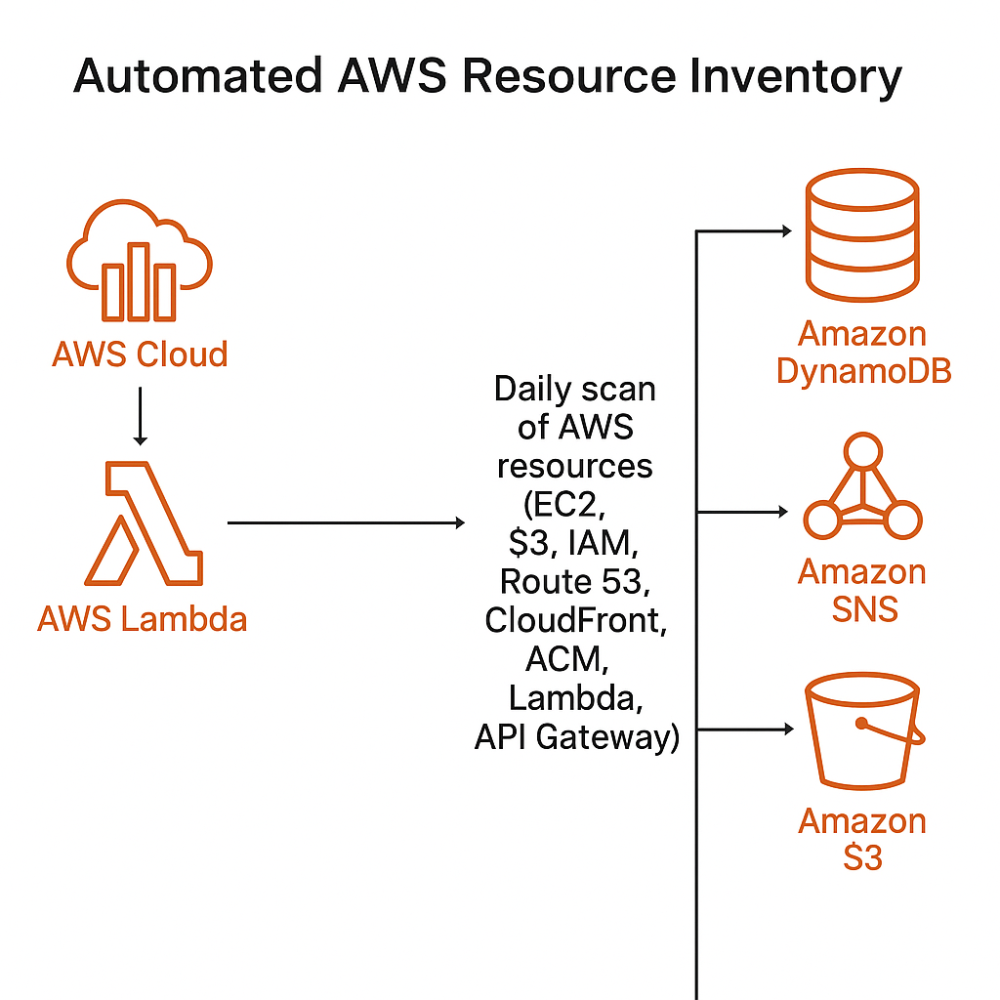

# 🛰️ Automated AWS Resource Inventory

A serverless infrastructure-as-code solution to automatically scan and inventory AWS resources across multiple services — including EC2, S3, IAM, Route 53, CloudFront, ACM, Lambda, and API Gateway — and store the results in DynamoDB with daily reporting via SNS.

---

### 📦 Features

- 🔁 **Daily automated scans** of AWS resources
- 🧠 Inventories EC2, S3, IAM, Route 53, CloudFront, ACM, Lambda, API Gateway
- 📥 Stores results in a DynamoDB table
- 📬 Sends daily summary notifications via SNS
- 🛠️ Fully deployed using Terraform for consistent, repeatable infrastructure
- ☁️ Uses AWS Lambda + Boto3 (Python) for scalable, serverless operation

---

### 🧱 Architecture

- **Lambda Function** (Python) runs daily to scan AWS services
- **CloudWatch Events (EventBridge)** triggers the Lambda function on a schedule
- **DynamoDB** stores inventory data (resource ID, type, metadata, timestamp)
- **SNS** sends a daily summary notification
- **Terraform** provisions the entire stack




---

### 🚀 Technologies Used

| Tool       | Purpose                               |
|------------|----------------------------------------|
| AWS Lambda | Serverless function for scanning       |
| Boto3      | AWS SDK for Python                     |
| DynamoDB   | NoSQL storage for inventory data       |
| SNS        | Notifications for inventory reports    |
| CloudWatch | Scheduling + logging                   |
| Terraform  | Infrastructure as Code (IaC)           |

---

### 📁 Project Structure

```
AutomatedAWSResourceInventory/
├── lambda/                         # Serverless function logic (Python)
│   ├── lambda_function.py          # Lambda code that scans AWS services and pushes data to DynamoDB + SNS
│   └── lambda_function.zip         # Zipped deployment package uploaded to S3 (built from the .py)
│
├── terraform/                      # Infrastructure-as-Code definitions
│   ├── main.tf                     # Main Terraform config: Lambda, IAM, CloudWatch,DynamoDB, SNS
│   ├── outputs.tf                  # Outputs like ARNs or resource names for reference
│   └── variables.tf                # Input variables used throughout the Terraform files
│
├── config/                         # Environment-specific configs
│   ├── terraform.tfvars            # Actual values for the Terraform input variables (region, function name, etc.)
│   └── aws.env                     # (Optional) local environment variables or AWS credentials file
│
├── architecture-diagram.png        # Visual overview of how the architecture works (text/diagram)
├── .gitignore                     # Files/folders to ignore in Git (e.g., .zip files, .terraform/)
└── README.md                      # Project documentation with usage, setup instructions, and description
```

### 📧 **Email Notifications**

The SNS topic sends a daily email report summarizing the AWS resource inventory. Make sure to subscribe your email to the SNS topic manually:
1. Go to AWS SNS Console.
2. Find the **InventoryReports** topic.
3. Subscribe using your email address.
4. Confirm the subscription from your email inbox.

---

### 🌟 **Monitoring**

- **CloudWatch Logs:** Check logs for Lambda execution errors.
- **DynamoDB Table:** Verify data insertion.
- **SNS Email:** Daily notifications on successful scans.

---

### 🧹 **Cleanup**
There are 2 options: 
1. To disable the Daily Trigger Only (keep your Lambda code for future use)
```
aws events disable-rule --name DailyInventoryTrigger
```

2. To delete all resources created:
```bash
terraform destroy -auto-approve
cd terraform
terraform destroy -var-file="../config/terraform.tfvars"
```


### ✅ Things to Check in AWS Console (Post-Project)
### **1. CloudWatch Events / EventBridge (Scheduled Lambda)**

Go to:  **Amazon EventBridge → Rules**
- Look for: `DailyInventoryTrigger`
- Check if it says: `Status: Disabled`
- If it still says `Enabled`, click it → choose **"Disable"**

---

### 🛠 **2. AWS Lambda**

Go to: **AWS Lambda → Functions**
- Look for: `ResourceInventoryLambda`
- It’s fine if it's still there — Lambda does **not** run unless invoked
- Just make sure it’s **not being auto-triggered** > Configurations > Trigger > Should show Rule state: DISABLED

---

### 📬 **3. SNS (Notifications)**
Go to:  **Amazon SNS → Topics → InventoryReports**
- SNS costs are near zero unless it's actively sending emails/SMS/etc.
- You can optionally **unsubscribe** or remove test subscriptions

---

### 📦 **4. DynamoDB**
Go to:  
**DynamoDB → Tables → ResourceInventory**
- DynamoDB PAY_PER_REQUEST tables are cost-efficient if left alone
- You won’t incur significant charges unless it’s actively used
- Optional: You can export it to S3 or clean it later
---

### 📊 **5. CloudWatch Logs**
 Go to:  **CloudWatch → Log Groups → `/aws/lambda/ResourceInventoryLambda`**
- These stay until they expire (you set `retention_in_days = 3`)
- Nothing runs unless invoked
- Logs will slowly age out

---


### To Re-deploy everything 
```
terraform apply -var-file="../config/terraform.tfvars" -auto-approve
aws events enable-rule --name DailyInventoryTrigger
``` 


Happy Automating! 🎉
